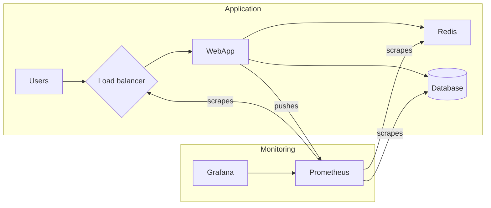

# practical-test

## Notes

## Diagram

High-level diagram of a monitoring setup. Most of the tools provide a `/monitoring` Prometheus endpoint, that can
be scraped and stored in Prometheus, to then visualize and alert using Grafana. Also there's a chance to push
metrics to Prometheus from the application itself.

