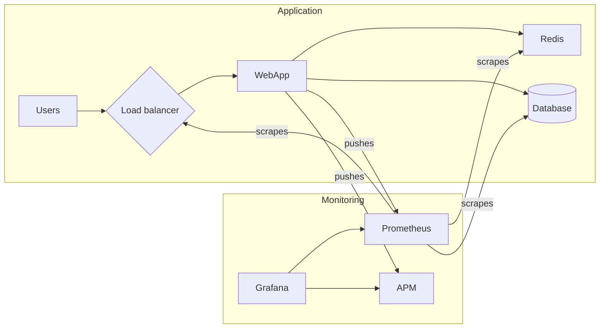

# practical-test

## Notes

### Web Server
Small app written in Python, using Django framework. I had some knowledge about this framework that's why I chose it.
It connects to a MySQL database, and a Redis instance.

### Docker
Using minimal Python Alpine image, but the Django framework is not lightweight, so the image has around ~200MB, but it's fast and easy to build. `docker-compose.yml` is the main compose file, and in `docker-compose.ci.yml` I'm just overwriting the `image` field to use the environment variables that are available in the Jenkins pipeline.

Commands:
```
$ docker compose build
$ docker compose up
```

### Jenkins

Simple pipeline to build, test, push, and deploy image to Kubernetes. I'm using Kustomize because it's a simple tool to modify small apps, but as soon as the resources are bigger or there are too many changes to do, maybe Helm could be a good replacement.

Some assumptions:
* There's some kind of Ingress Controller installed in Kubernetes
* Jenkins has kustomize/docker installed in their worked nodes

### Monitoring

High-level diagram of a monitoring setup. Most of the tools provide a `/monitoring` Prometheus endpoint, that can
be scraped and stored in Prometheus, to then visualize and alert using Grafana. Also there's a chance to push
metrics to Prometheus from the application itself. If we want to use something like an APM tool, usually it involves adding a command to the startup process (the webserver in this case), and this can be done in the `Deployment` resource.



### Terraform

There are two modules:
* VPC: Creates a VPC with three public/private subnets, along with the corresponding NAT gateways and EIPs.
* EKS cluster: Create a simple EKS cluster, with one AWS managed nodegroup, and its corresponding security group.

I used these modules to create both the VPC and EKS cluster, is a good practice to use modules so the TF code is easily reusable.
